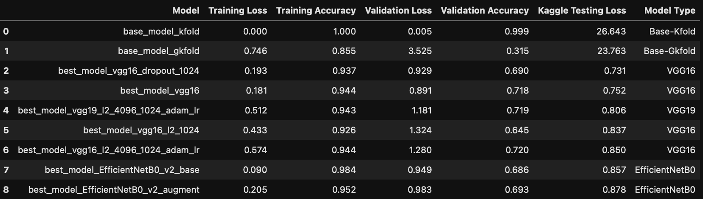
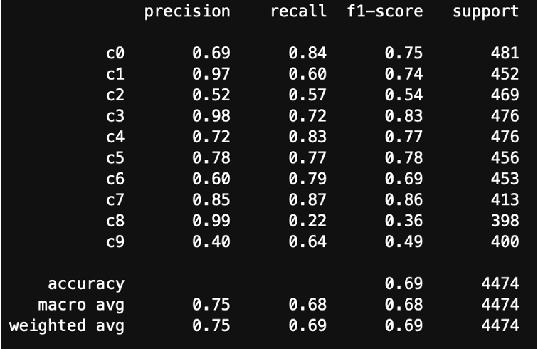
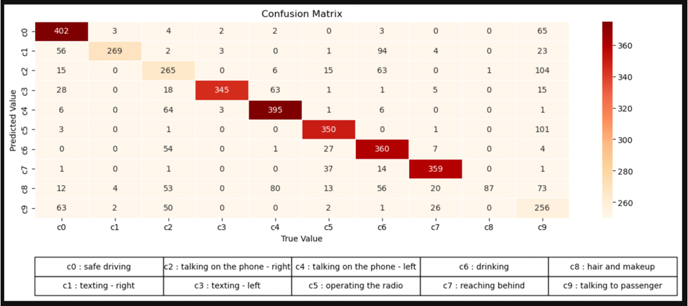
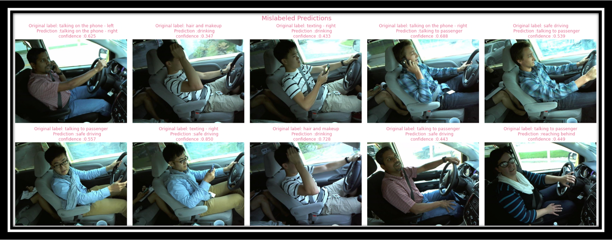

<!-- omit in toc -->
# State Farm Distracted Driver Detection

<!-- omit in toc -->
# Contents
- [Problem Statement](#problem-statement)
- [Datasets](#datasets)
- [Observations from EDA](#observations-from-eda)
- [Modeling Methodology](#modeling-methodology)
- [Results](#results)
- [Conclusions](#conclusions)
- [References](#references)

# Problem Statement
We see people trying to multi-task while driving very often. Driving is a task which requires our complete attention on the road. Despite that, NHTSA reports that distracted driving claimed 3,142 fatalities in 2019 and countless other injuries ([source](https://www.nhtsa.gov/risky-driving/distracted-driving)). 

We hope to identify and alleviate the widespread problem of distracted driving by using Machine Learning (ML). In this project, we used data from the [Kaggle State Farm Distracted Driver Detection challenge](https://www.kaggle.com/c/state-farm-distracted-driver-detection/overview). The data contains snapshots from a video captured by a camera mounted in the car. We use these images to classify each driver's behavior. Are they driving attentively,wearing their seatbelt, or taking a selfie with their friends in the backseat?  

 
[source](https://www.kaggle.com/c/state-farm-distracted-driver-detection/data) 

[Back to Top](#Contents)

# Datasets
A critical aspect of this dataset which makes the deep learning process challenging is that the subjects do not appear in both the train and test datasets. These images were generated for different subjects using video capturing their driving behavior. 

The training dataset consists of 22.4k images of 26 different subjects. These images are approximately uniformly distributed over 10 classes of driver behavior. 

The 10 classes to predict are:
* c0: safe driving
* c1: texting - right
* c2: talking on the phone - right
* c3: texting - left
* c4: talking on the phone - left
* c5: operating the radio
* c6: drinking
* c7: reaching behind
* c8: hair and makeup
* c9: talking to passenger

The testing dataset consists of 79.7k images belonging to a different subset of drivers.

The above dataset can be downloaded [here](https://www.kaggle.com/c/state-farm-distracted-driver-detection/data).

Also included in the dataset are the following files:

* [sample_submission.csv](./data/csv/sample_submission.csv) - a sample submission file in the correct format
* [driver_imgs_list.csv](./data/csv/driver_imgs_list.csv) - a list of training images, their subject (driver) id, and class id

[Back to Top](#Contents)

# Observations from EDA
* As the images are taken from video clips, multiple images from the same class tend to be very similar to each other. This characteristic can be exploited to improve model performance.
* Number of test images are about 4 times larger than train images. This can lead to overfitting and must be addressed.
* The drivers for test images are entirely different from those for train images. Model training needs to address this behavior.

[Back to Top](#Contents)

# Modeling Methodology
* **Training, Validation Sets:**
To evaluate model training, we split the training images into training and validation sets. We initially used a random train-test-split to generate training and validation sets. This caused the trained model to be significantly overfit. We then used [GroupKFold](https://scikit-learn.org/stable/modules/generated/sklearn.model_selection.GroupKFold.html) and grouped on the driver id. This was done to ensure that each driver only appears in either the training or the validation set. This step helped reduce model overfitting leading to a more robust model. 

* **Model Architecture:**
Convolutional neural networks (CNN) are similar to ordinary neural networks but they are customized to use images as inputs. We tried different CNN model architectures for evaluating model performance.
	* Custom CNN Model
  	This model has 2 Convolutional (Conv) (Conv2D + MaxPooling2D) layers, followed by 2 Fully Connected (FC) layers and a final SoftMax activation layer for classification. 	All layers use ReLU activation except where mentioned.
	* VGG-16 & VGG19
	Use pre-trained VGG16 & VGG19 model for transfer learning followed by fully connected layers and a final SoftMax activation layer for classification. 
	* EfficientNetB0
	Use pre-trained EfficientNetB0 model for transfer learning, followed by 1 GlobalAveragePooling2D, 1 BatchNormalization and 1 Dropout layer.This is followed by a final SoftMax activation layer for classification.

* **Image Augmentation:**
Image augmentation applies different transformations like rotation, shear, horizontal and vertical offsets etc. to the original images resulting in multiple transformed copies of the same image. These techniques expand the size of the dataset and incorporate variation in the dataset which allows model training to generalize better on unseen data. 
We used augmentation only on the training set (not validation set) and trained models with / without augmentation. This was done using the [ImageDataGenerator](https://www.tensorflow.org/api_docs/python/tf/keras/preprocessing/image/ImageDataGenerator) class in Keras.

[Back to Top](#Contents)

# Results
- Base model with a random train test split has an accuracy of 1 for both the training and validation sets but the log loss on the testing dataset is very high
- The accuracy of the model suffers when train test split is generated using GroupKFold. The log loss on the testing dataset is marginally lower
- VGG16 model with a single dense layer and a dropout layer gave the lowest log loss of 0.73 on the testing dataset. This model has an accuracy of 93% for training dataset and 69% for testing dataset. The model is overfit.
- VGG19 model had a slightly improved training and validation accuracy scores but the log loss on the testing dataset was 0.806
- Efficient net model has the lowest log loss value for the training dataset but the highest log loss on the testing dataset. This model though runs significantly faster as it has much lesser trainable parameters
  

  Class labels c8 and c9 have the lowest f1-scores and class labels c3 and c7 have the highest f1-scores
  
  **Classification Report for VGG16 Model**  

  
  **Confusion Matrix for VGG16 Model** 

  Following figure shows a collection of sample images where the model predictions were wrong. The title of each image shows the information of the original label, prediction and confidence value of that prediction as determined by the model
  
  **Mislabeled Predictions Sample** 
# Conclusions
- Use of pre-trained models significantly improved the predictions of the CNN model
- A CNN model using a VGG16 pre-trained model gave log loss for testing dataset on Kaggle of 0.73

[Back to Top](#Contents)

# References
- [Classification of Driver Distraction](http://cs229.stanford.edu/proj2016/report/SamCenLuo-ClassificationOfDriverDistraction-report.pdf)
- [Fine-tuning using pre-trained models](https://learnopencv.com/keras-tutorial-fine-tuning-using-pre-trained-models/)
- [Image classification via fine-tuning with EfficientNet](https://keras.io/examples/vision/image_classification_efficientnet_fine_tuning/#image-classification-via-finetuning-with-efficientnet)
- [Transfer Learning in Keras with Computer Vision Models](https://machinelearningmastery.com/how-to-use-transfer-learning-when-developing-convolutional-neural-network-models/)
- [Image Augmentation on the fly using Keras ImageDataGenerator](https://www.analyticsvidhya.com/blog/2020/08/image-augmentation-on-the-fly-using-keras-imagedatagenerator/)

[Back to Top](#Contents)